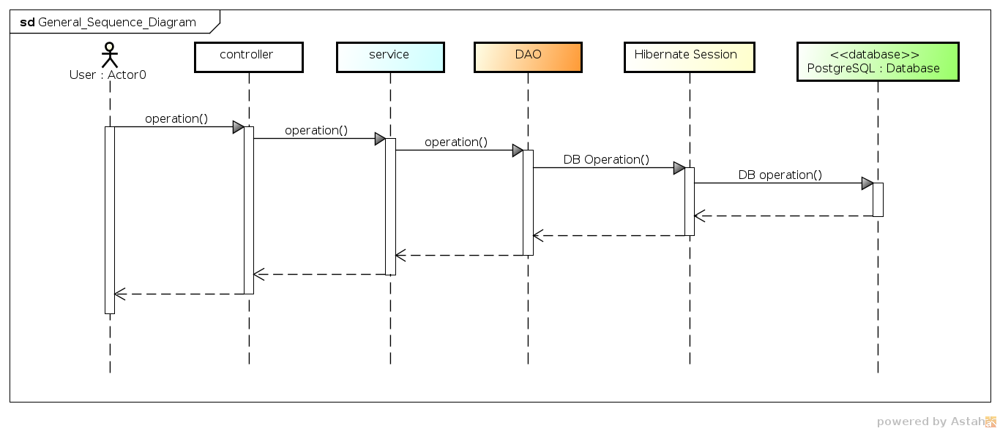
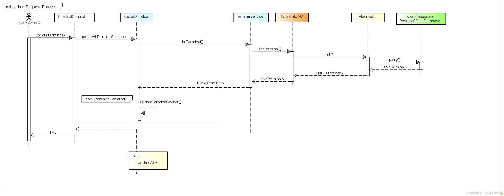
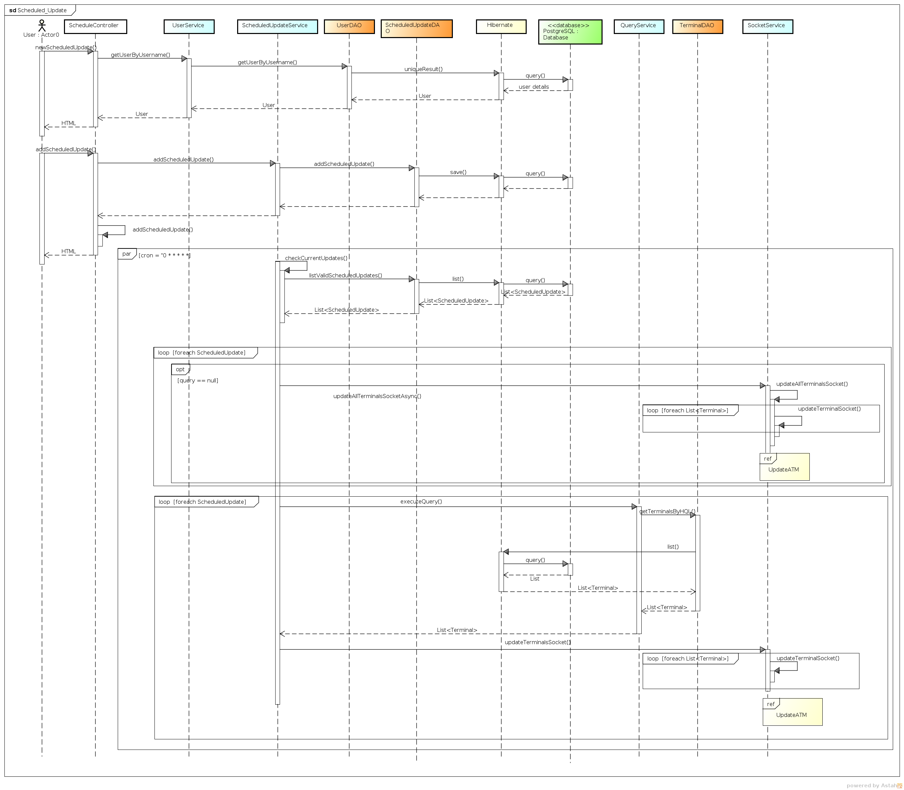
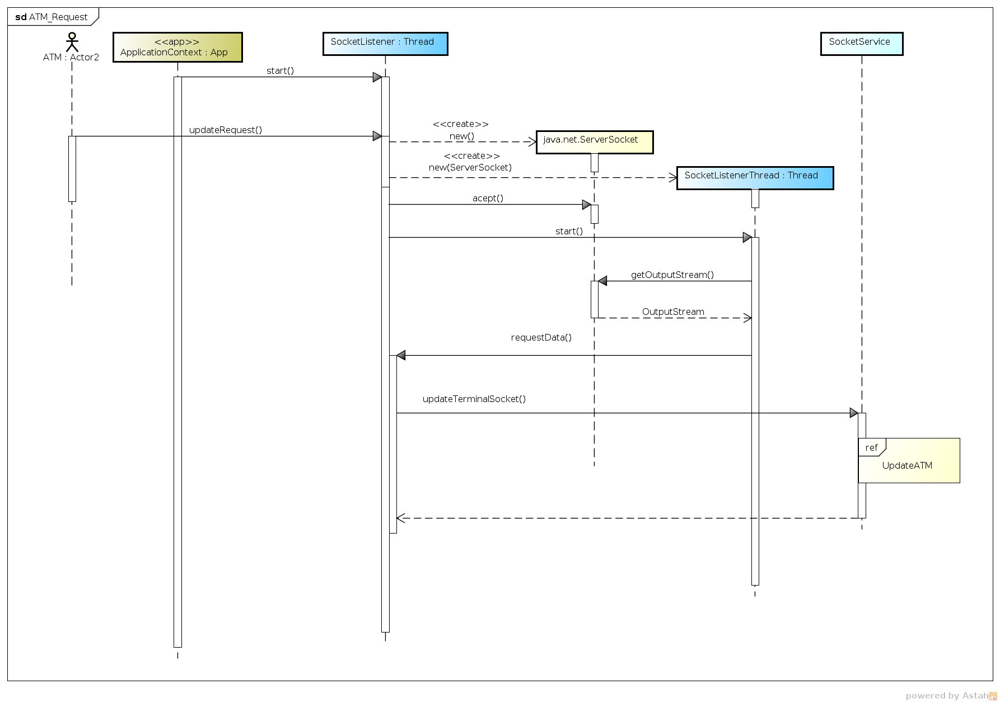
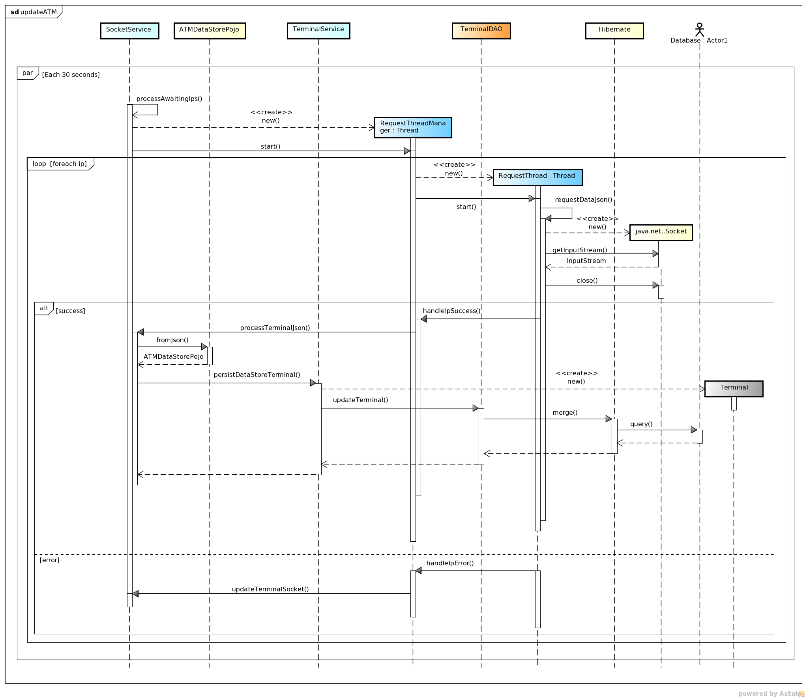

****************
Secuence Diagram
****************
In this section are presented the sequence diagrams that allow to understand how the different calls are made between the objects

General Secuence Diagram
========================

      
The general behavior of ATMMonitoring is as shown above, first the user select an operation from the HTML view, that operation send a message to the corresponding controller, after the message is received,  the controller invokes a service to operate over the entities. When the service receive the message, it will call the corresponding DAO operation. Finally the DAO will use the Hibernate session to perform the corresponding Database operation.

After the operation has ended in the database, hibernate will generate the object, if the operation was a fetch, or will update the state of each entity object. Then the result of the operation will be show to the user.

Update Request
==============
The update process can be made by two actors, the user or the ATM itself. The user can request an update in two ways, first , requesting it using the web page, the other scheduling an update that will run   in a specific time defined by the user

User Request
%%%%%%%%%%%%

The user request made by the web page, fires the update process by clicking a button in the HTML view, below is presented the sequence diagram of that process.

      
First the user calls the controller by pressing the update button, that calls the method *updateTerminal* in the *TerminalController* who calls the *SocketService* to initiate the update process. The *SocketService* asks to *TerminalService*  for all the terminals that can be updated, when the *SocketService* receives the list,  calls the method in charge to update the list of terminals to be updated.

In paralell the  `Update Process`_ will run each 30 second to perform the actual update

Scheduled Request
+++++++++++++++++

The scheduled update is made by the user using the HTML interface where he can plan an update base on a saved query, which will bring all the ATM's that will be updated in a given time,day or date. The following is the sequence diagram of that process

      
To add a new scheduled update, first is necessary to know all the queries saved by the user, for that reason the *ScheduledController* call the *UserService*.

For adding the new scheduled update, the user after fill all the required fields on the HTML interface, submits the information to the *ScheduledController* , calling the addScheduledUpdate, that method will invoke the *ScheduledService* who will call the corresponding DAO in order to save the new scheduled update.

In parallel a process will be running in order to check if some scheduled updates must be executed, this process starts in the *ScheduledService*, who first asks to the *ScheduledDAO* for all scheduled updates available, then, it will obtain the corresponding *Terminal* and then, after calling the *SocketServer*,  the   `Update Process`_  will start

ATM Request
%%%%%%%%%%%

The ATM can call the ATMMonitoring in order to indicate that an update has occur, this is possible because the ATMMonitoring has a server that is listening to any possible request from the ATM's. This server and the clients are Sockets implementations.
Below is possible see the sequence diagram of this process.

   
The first step in this process is in charge of the  application context, in other words, the Tomcat and the Spring Framework. When the application starts for the first time, it create a new Thread (*SocketListener*) that will act as a server that listen in a specific port waiting for an update from a ATM to come. 
When a new request arrives, the *SocketListener* creates a new `Socket <http://docs.oracle.com/javase/7/docs/api/index.html?java/net/Socket.html>`_  and passes it  to a new *SocketListenerThread*  who will be in charge to extract the message from the remote ATM client. After the message is received, the control is returned to the *SocketListener* who will call the *SocketService* in order to start the  `Update Process`_    
      
Update Process
%%%%%%%%%%%%%%

The Update process is in charge of updating the ATM info in the Database, is a cron process that runs in a specific period of time, calling the remotes ATM clients and asking to return the information. The following diagram illustrate how this process was implemented  

The *SocketService* has a method called **processAwaitingIps** that was marked as an `Spring Scheduled process <http://docs.spring.io/spring/docs/3.1.3.RELEASE/javadoc-api/org/springframework/scheduling/annotation/Scheduled.html>`_  which means that the method will run in a defined period of time, just like a `cron process in Linux <http://en.wikipedia.org/wiki/Cron>`_

When  **processAwaitingIps** runs, it reads all the ips ( in string ) contained in a private Set attribute of the class, if that Set is not empty, the method will create a new *RequestThreadManager*, which will iterate over each stored ip and create a new *RequestThread* per each ip to retrieve the information from the ATM's

The *RequestThread* will open a Socket to communicate to a remote ATM, if the *RequestThread* can get the information from the ATM (success), will call the method *handleSuccess* in the *RequestThreadManager*, from there the method *processTerminalJson* in the *SocketService* will be called which will read the JSON received from the ATM. After the JSON is read, the information obtained will be saved into the Database calling the method *persistDataStoreTerminal* in the class *TerminalService* 

If the information from the ATM can not be obtained (error) , the *RequestThread* will call the method *handleError* in the class *RequestThreadManager*, from there, the method *updateTerminalSocket* in the class *SocketService* will be called and all the ip's from the ATM's that returned an error will be put into the Set to try again in another cycle      
      
Query Management
================
Each user of ATMMonitoring can create, store and execute Queries that fetch a list of ATM's, those querys can be use in the update process 

.. image:: diagrams/Sequence_Diagrams/Query_Secuence_Diagram.png
      :width: 800px
      :align: center
      :height: 400px

In order to save a new query or update an existing one, the user must select all the fields and specify the conditions that can bring a list of ATM's, all this in the HTML user Interface, when the user has set all the parameters he press the button that will call the method *saveOrUpdateQuery* in the *QueryController*, also depending on the operation, a parameter will travel in the request in order to know which operation is being executed. Depending on the value of that parameter, the method *addQuery* (for saving) or *updateQuery* (for updating) in the *QueryService* will be called and from there the operation to be executed will be either a save or a update in the database.

For executing the query, the user press the corresponding button in the HTML interface that will call the same method *saveOrUpdateQuery* in the *QueryController*, the difference is that the value in the parameter inside the request will hold the value  *execute*. The *QueryController* will then call the method *executeQuery* in the *QueryService*, and that service will call the method  *getTerminalsByHQL* in the *TerminalDAO*. That method is in charge of generating and executing the query from the parameters selected by the user. When the operation is performed, the list of matching ATM's is shown to the user

Diagrams Download
=================

This diagrams were made using `Astah Community Edition 6.8.0/d254c5 <http://astah.net/download)>`_

* :download:`Secuence Diagrams Diagram <uml-diagrams/Sequence_Diagrams.asta>`