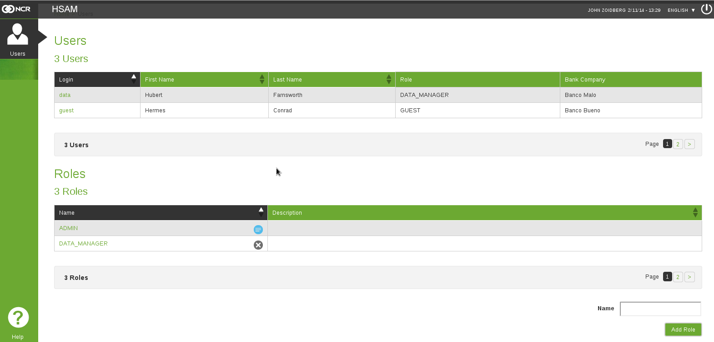
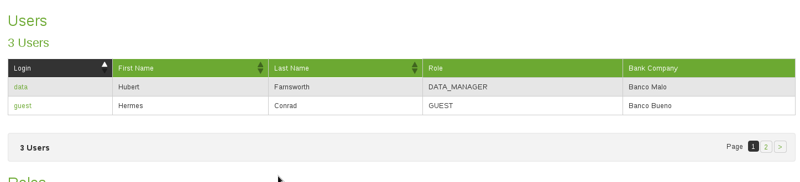

*****
Users
*****

We can access Users  page through the link *Users* the side menu.

.. figure:: resources/help/es/images/usersLeftButton.png
	:width: 40pt
	:align: center

	Link to *Users* in the side menu.

The Users page is where is possible to manage the users and their roles inside the application

	Users Page

User Management
---------------
The user management section is located at the top of the working area

	User Management

there is possible to see a table where all the users registered in the application are shown. Here is possible to perform three operations:
  
	* *See the login information*: By clicking on the row where the user is, is possible to go to the login data page, where is shown the actual data linked to the user, from there is possible to perform the Edit operation, just click in the *Edit User* button located at the bottom right.

		.. figure:: resources/help/es/images/loginData.png
			:align: center
			:width: 400px
			:height: 300px

			Login Data

	* *Edit user information*: In this section is possible to edit the user information, just select the desired field, change the value and press *Update User Data*
	* *Change the role of the user*: To change the role, select the new role from the combo box in the window and press *Update User Data*

		.. figure:: resources/help/es/images/updateUserData.png
			:align: center
			:width: 400px
			:height: 300px

			Update Login Data	

Role Management
---------------
